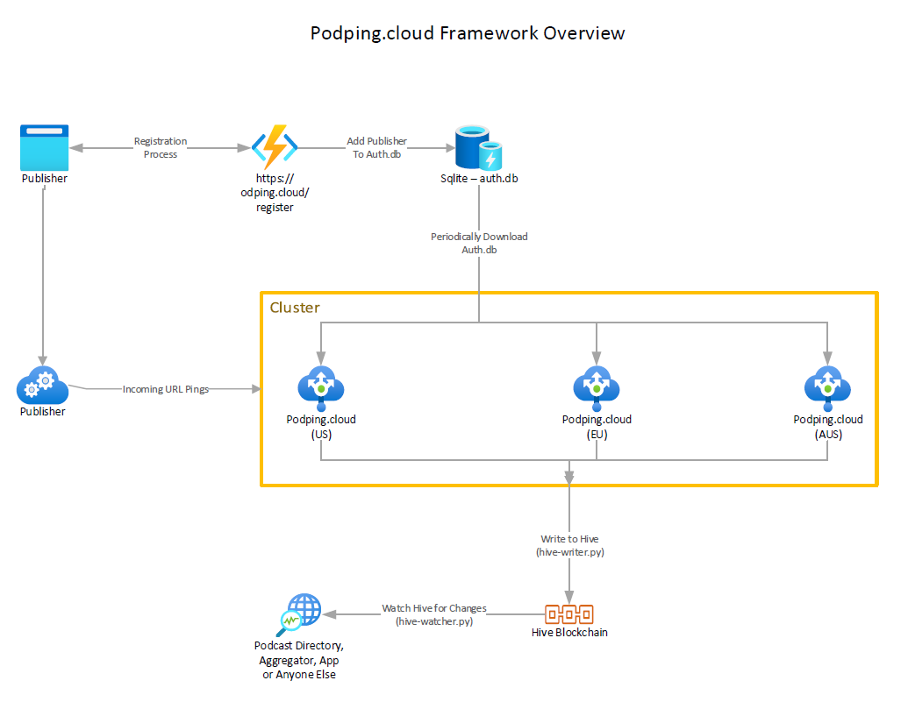

# Podping.cloud
The server code that runs a podping.cloud node.

<br>

## Node Overview

There are two main components of a podping.cloud node.  The first is a web HTTP front-end just called `podping` that accepts GET requests like so:

```http
GET https://podping.cloud/?url=https://feeds.example.org/podcast/rss
```

The next component is `hive-writer` - a python script that listens on localhost port `9999` for incoming urls terminated by a newline character.  When it receives one, it attemps to write it as a custom JSON notification message to the Hive blockchain.

<br>

## Web Front-End (podping.rs)

The front-end accepts this request and does a few things:

1. Ensures that the sending publisher has included a valid 'Authorization' header token.
2. Validates that the format of the given podcast feed url looks sane
3. Saves the url into the `queue.db` sqlite database in the `queue` table.
4. Returns `200` to the sending publisher.

A separate thread runs in a loop every 3 seconds as a queue checker and does the following:

1. Checks the `queue.db` database fetches 10 feeds at a time in FIFO order.
2. Opens a tcp socket to the `hive-writer` listener on port `9999`.
3. Sends the url string to `hive-writer` socket for processing and waits for "OK" to be returned.
4. If "OK" is returned from the hive writer python script, the url is removed from `queue.db`.
5. If "ERR" is returned or an exception is raised, another attempt is made on the next cycle.

The web front-end looks up incoming request 'Authorization' header tokens in the `auth.db` sqlite db to ensure they are valid before processing the incoming HTTP GET request.

There is a dummy auth token in the `auth.db` that is ready to use for testing.  The token value is:

<br>

```text
Blahblah^^12345678
```

<br>

## Blockchain Writer (hive-writer.py)

The python script `hive-writer.py` does the following:

...Brian will describe...

<br>

## Running

First clone this repo.

Make sure that libzmq-dev is installed:

`apt-get install libzmq3-dev`

Build and launch podping like so:

`cd podping && crate run`

Then launch hive-write like this:

`python3 ./hive-writer/hive-writer.py`

<br>

## Important Note

This software is unstable and not ready for production.  Please do not use it except for tinkering.

The hive-writer agent requires permission keys that are not included in this repo.  They should be exported into your 
shell environment before launching the script.

<br>

## The Podping Network Idea

