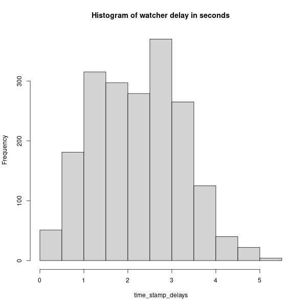

# This example
The intent here is to create a data.csv plain text file for quick data exploration of the podping data being reported from the hive blockchain.

# Dependancies
- Linux (install depenencies examples here are for apt (debian based distros)
- Ensure python3 and pip are installed (check with `pip --version`)
- Install beem wit pip
```
pip3 install beem
```
- Install R
```
sudo apt install r-base r-base-core r-recommended
```
# Running the scripts
## Everything is a script
Some automation - make these scripts executable
- navigate to this example's folder and run:
```
sudo chmod +x *.py *.sh *.R
```
## Collect data
Then to begin or resume collecting data run:
```
./run_watcher.sh 
```
## Visualize it
To run the data visualization script run
```
./visualize-data.R 
```

## Results


