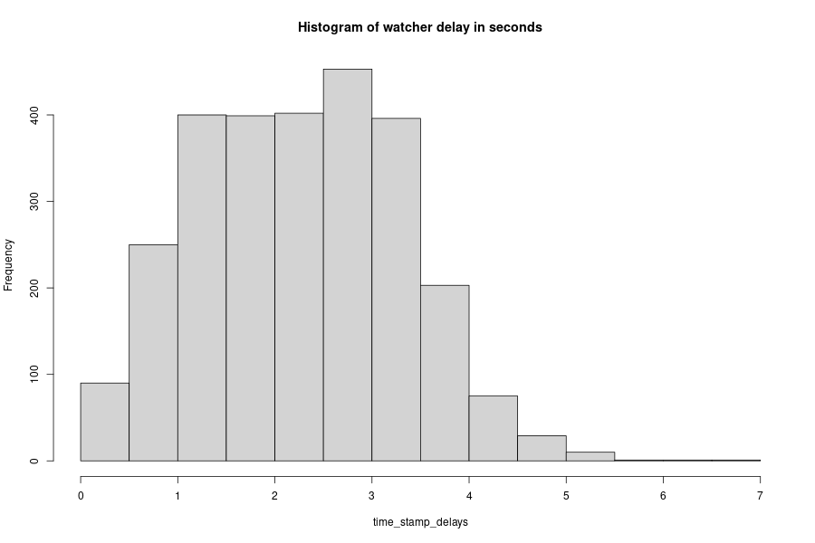
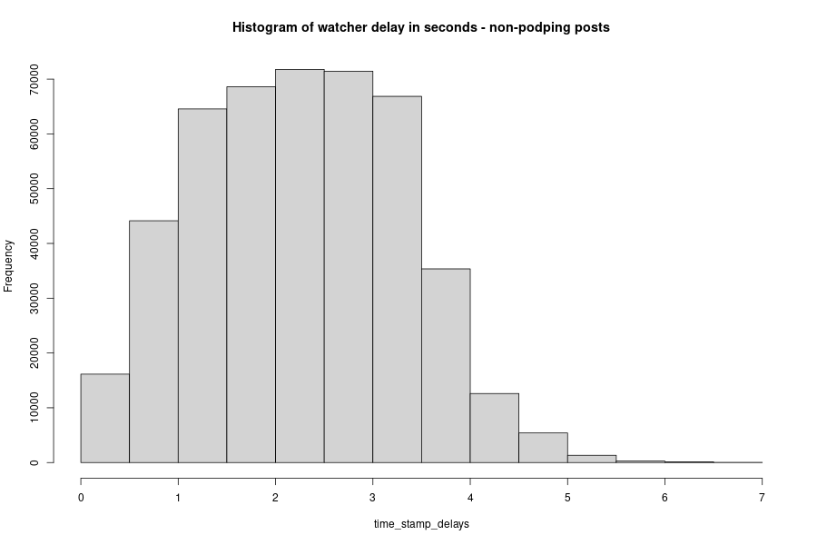

# This example
The intent here is to demonstrate how to create a .csv file on disk for data exploration in [R](https://cran.r-project.org/) of the [podping](podping.cloud) data being reported on the [hive.io](hive.io) blockchain. 

The .csv file format is terribly inefficient, look to use sqlite or another method to write to, this is just an example. 15 hours of ingesting all hive 'custom json' posts consumed well over 200 mb in disk space!

# Dependancies
- Linux (install depenencies examples here are for apt (debian based distros)
- Ensure python3 and pip are installed (check with `pip --version`)
- Install beem wit pip
```
pip3 install beem
```
- Install R
```
sudo apt install r-base r-base-core r-recommended
```
# Running the scripts
## Everything is a script
Some automation - make these scripts executable
- navigate to this example's folder and run:
```
sudo chmod +x *.py *.R
```
## Collect data
Then to begin or resume collecting data run:
```
./hive-watcher-write-to-csv.py
```
Or use the much prefered
```
./hive-watcher-write-to-feather.py
```
 The data-not-podping_firehose.csv file is 205MB after 15 hours of watching the hive API.

## Visualize it
After running for awhile run the data visualization script with:
```
./visualize-data.R 
```

## Results
What's the delay between the watcher and the posted time stamp on the hive blockchain?
Here is a histogram for that.


And for all other 'custom json' posts on hive for the same period


And others. 

The last thing the [visualize-data.R](visualize-data.R) script does is write as a log the following to a [.ndjson file](stats/summaryStats.ndjson):

```
Podping hive "custom json" post summary:
    Post count is 2710 (2.95 posts/min)
    Total urls posted is 12128 of wich 6258 are unique
        (average of 4.48 urls/post)
    All 'other' hive post count is 458672 (500 posts/min)
    Podping portion of all 'custom json' posts on hive is 0.58737%
    From 2021-05-20 03:46:36 UTC to 2021-05-20 19:03:56 UTC
    Watched for 15 hours 17 minutes and 20.15 seconds
#podping #Stats
```

# Projects based on this example
- On github -> [podping-stats](https://github.com/seakintruth/podping-stats) for (planned) further development of these scripts into a mastodon toot bot about these statistics, and/or visualization dashboards on websites.