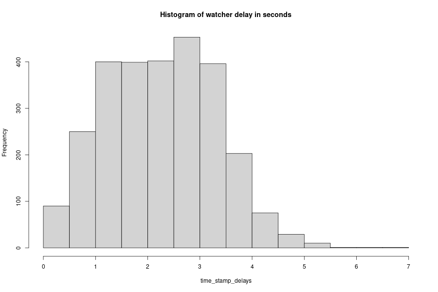
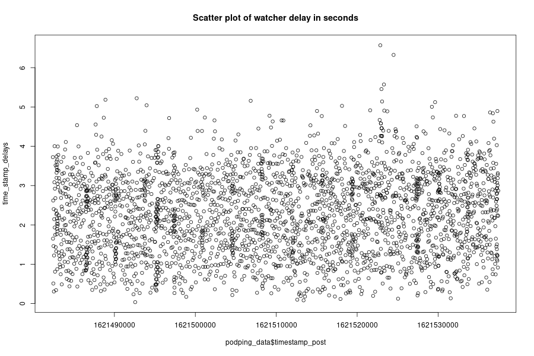

# This example
The intent here is to demonstrate how to create a .csv OR [.feather](https://arrow.apache.org/docs/python/feather.html) file on disk for data exploration in [R](https://cran.r-project.org/) of the [podping](podping.cloud) data being reported on the [hive.io](hive.io) blockchain.

# Dependancies
- Linux (install depenencies examples here are for apt (debian based distros)
- Ensure python3 and pip are installed (check with `pip --version`)
- Install beem wit pip
```
pip3 install beem
```
- Install R
```
sudo apt install r-base r-base-core r-recommended
```
# Running the scripts
## Everything is a script
Some automation - make these scripts executable
- navigate to this example's folder and run:
```
sudo chmod +x *.py *.R
```
## Collect data
Then to begin or resume collecting data run:
```
./hive-watcher-write-to-csv.py
```
Or use the much prefered
```
./hive-watcher-write-to-feather.py
```
 The data-not-podping_firehose.csv file is 205MB after 15 hours of watching the hive API.

## Visualize it
After running for awhile run the data visualization script with:
```
./visualize-data.R 
```

## Results
What's the delay between the watcher and the posted time stamp on the hive blockchain?
Here are some descriptive visualizations.



# Projects baised on this example
- See the repo [podping-stats](https://github.com/seakintruth/podping-stats) for (planned) further development of these scripts into a mastodon toot bot about these statistics, and visualization dashboards.
